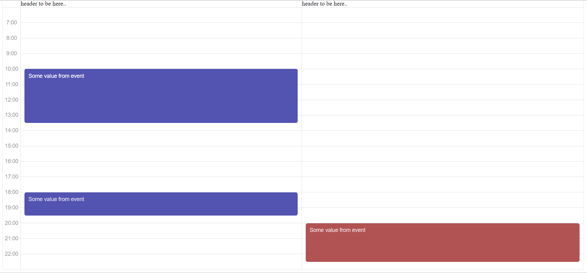

![Built With Stencil](https://img.shields.io/badge/-Built%20With%20Stencil-16161d.svg?logo=data%3Aimage%2Fsvg%2Bxml%3Bbase64%2CPD94bWwgdmVyc2lvbj0iMS4wIiBlbmNvZGluZz0idXRmLTgiPz4KPCEtLSBHZW5lcmF0b3I6IEFkb2JlIElsbHVzdHJhdG9yIDE5LjIuMSwgU1ZHIEV4cG9ydCBQbHVnLUluIC4gU1ZHIFZlcnNpb246IDYuMDAgQnVpbGQgMCkgIC0tPgo8c3ZnIHZlcnNpb249IjEuMSIgaWQ9IkxheWVyXzEiIHhtbG5zPSJodHRwOi8vd3d3LnczLm9yZy8yMDAwL3N2ZyIgeG1sbnM6eGxpbms9Imh0dHA6Ly93d3cudzMub3JnLzE5OTkveGxpbmsiIHg9IjBweCIgeT0iMHB4IgoJIHZpZXdCb3g9IjAgMCA1MTIgNTEyIiBzdHlsZT0iZW5hYmxlLWJhY2tncm91bmQ6bmV3IDAgMCA1MTIgNTEyOyIgeG1sOnNwYWNlPSJwcmVzZXJ2ZSI%2BCjxzdHlsZSB0eXBlPSJ0ZXh0L2NzcyI%2BCgkuc3Qwe2ZpbGw6I0ZGRkZGRjt9Cjwvc3R5bGU%2BCjxwYXRoIGNsYXNzPSJzdDAiIGQ9Ik00MjQuNywzNzMuOWMwLDM3LjYtNTUuMSw2OC42LTkyLjcsNjguNkgxODAuNGMtMzcuOSwwLTkyLjctMzAuNy05Mi43LTY4LjZ2LTMuNmgzMzYuOVYzNzMuOXoiLz4KPHBhdGggY2xhc3M9InN0MCIgZD0iTTQyNC43LDI5Mi4xSDE4MC40Yy0zNy42LDAtOTIuNy0zMS05Mi43LTY4LjZ2LTMuNkgzMzJjMzcuNiwwLDkyLjcsMzEsOTIuNyw2OC42VjI5Mi4xeiIvPgo8cGF0aCBjbGFzcz0ic3QwIiBkPSJNNDI0LjcsMTQxLjdIODcuN3YtMy42YzAtMzcuNiw1NC44LTY4LjYsOTIuNy02OC42SDMzMmMzNy45LDAsOTIuNywzMC43LDkyLjcsNjguNlYxNDEuN3oiLz4KPC9zdmc%2BCg%3D%3D&colorA=16161d&style=flat-square)

# General description
The library provides a set of native web-components to layout calendar of day events with ability to separate events by columns (resources). Library mostly is just a presenter of calendar layout, any dates filtering/manipulation should be done via wrappers.

# Purpose of creating
Currently lots of npm-components provides end-2-end ready components like scheduler. Scheduler is a pretty complex component and usually consists of such sub-areas:
1. Top panel with current-date, view-mode, date-mutation controls
2. Calendar board panel with events, timeline
3. Event inside board with its own layout and presentation
4. Interaction with the board (drag&drop, adding new events etc)

Looks pretty nice isn't it? By choosing any of such libraries developer can start using it immediately with lots of additional configuration and setup.
But there are a set of different situations which make these (end-2-end) libraries impossible to use in a particular web application:
- Web application already has a set of it's own components to control date (datepickers), it's own buttons/icons, we can layout such panel on our own
- Web application has a pretty complex layout for a particular event in calendar board with it's own behavior (builtin event layout doesn't work). In this very case developers of libraries often makes their components pretty "flexible" be creating a large configuration for their library. But still - even with as most large configuration as possible - it is much friendly for a developer to build his child event-calendar component on his own isn't it?

This reasons moved me to create a library with a set of presenter-components. Presenter component is a new term which means (mostly) component without real data control, but DOM control. Good example of complex native presenter component is <table>. To add header of a table you can add <thead> element, to add row <tr>. But native table won't let you an ability of adding paging, filtering, sorting or virtual scrolling - all data manipulations should be done by a wrappers data containers.

# API
1. Importing scheduler into your web application
```
import { defineCustomElements } from '@telenko/schedule-component/dist/loader';
```
2. Defining components
```
defineCustomElements(window);
```
3. Using components in your app (components api below)

# Components API
We didn't randomly compared scheduler to table element. Comparing with table can simplify understanding of scheduler API.
1. ```<schedule-day>``` is a container element (like ```<table>```)
2. ```<schedule-header>``` is a header column (like ```<th>```), but instead of headers container (```<thead>```) ```slot='header'``` should be used.
3. ```<schedule-resource>``` can be compared with ```<tr>``` element. Resource represents a group of events in a board (but unlike to row - vertically like a column)
4. ```<schedule-day-event>``` is an event in the board (can be compared to ```<td>``` like a low-level element with data inside). Event has such props as: 'from' and 'to' which receives a time for this event in a board in format ```HH:mm```. 
Example: 
```HTML
<schedule-day-event from='10:00' to='13:30'>
```

All-together example:
```HTML
<schedule-day style='height: 700px;'>
    <schedule-header slot='header'>
        header to be here..
    </schedule-header>
    <schedule-header slot='header'>
        header to be here..
    </schedule-header>
    <schedule-resource>
        <schedule-day-event from='10:00' to='13:30'>
            <div style='border-radius: 5px;background-color: rgba(64, 64, 168, 0.9);color: white;'>
                <div style='padding: 10px;'>Some value from event</div>
            </div>
        </schedule-day-event>
        <schedule-day-event from='18:00' to='19:30'>
            <div style='border-radius: 5px;background-color: rgba(64, 64, 168, 0.9);color: white;'>
                <div style='padding: 10px;'>Some value from event</div>
            </div>
        </schedule-day-event>
    </schedule-resource>
    <schedule-resource>
        <schedule-day-event from='20:00' to='22:30'>
            <div style='border-radius: 5px;background-color: rgba(168, 64, 64, 0.9);color: white;'>
                <div style='padding: 10px;'>Some value from event</div>
            </div>
        </schedule-day-event>
    </schedule-resource>
</schedule-day>
```

